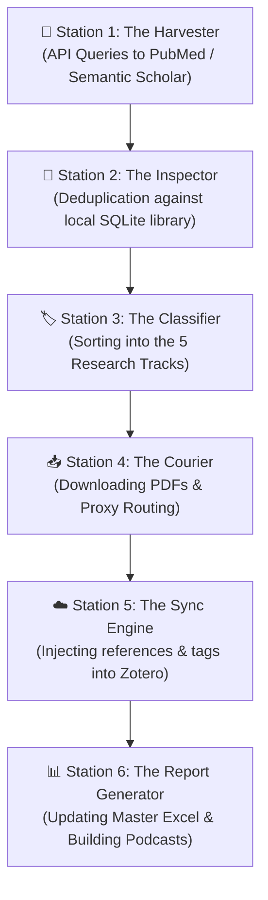
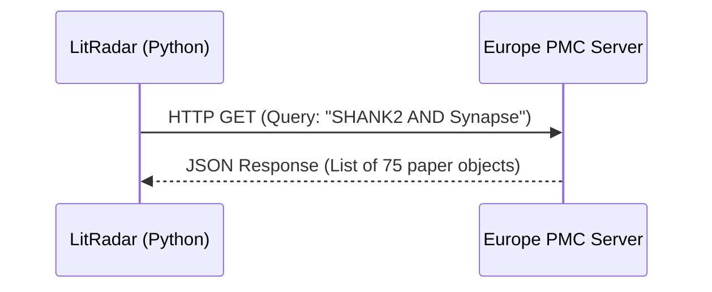
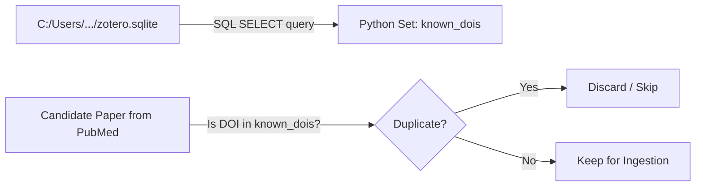
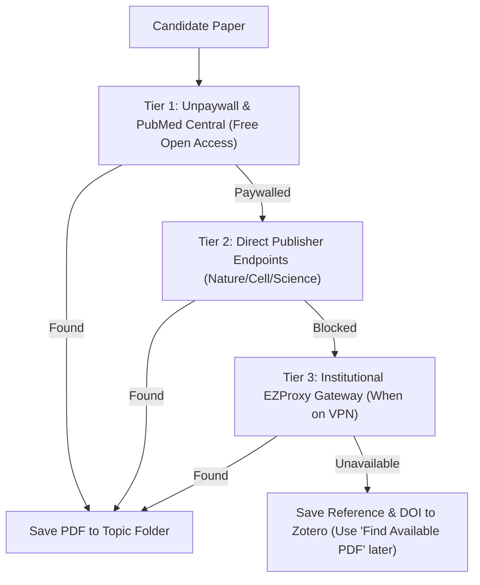

# 🧭 LitRadar: Codebase & Software Architecture Guide
> **An Educational Walkthrough for Emerging Python Developers**

Welcome! This guide breaks down the inner workings of **LitRadar** — from how software interacts with scientific databases to how data structures and files are managed on your computer.

---

## 🏗️ 1. Big-Picture Architecture: The Assembly Line

Think of LitRadar like an **automated factory assembly line** with 6 distinct stations:



Every piece of data flows through this pipeline as a standard Python **Dictionary** (a key-value map like `{"title": "...", "doi": "...", "year": 2026}`).

---

## 🧩 2. Modular Breakdown: Component by Component

### Component 1: `config.py` — The Central Nervous System
* **Real-world analogy:** The lab bulletin board where all important phone numbers, addresses, and door codes are posted.
* **Why it matters in coding:** Never hardcode file paths or API keys across multiple files. If a path changes, you only want to change it in **one place**.

```python
# How LitRadar anchors all relative paths regardless of where the folder lives:
from pathlib import Path

# Path(__file__) is the location of THIS file.
# .resolve().parent goes up one directory level.
BASE_DIR = Path(__file__).resolve().parent.parent

# Everything else branches from BASE_DIR
OUTPUT_DIR = BASE_DIR / "output"
PODCAST_DIR = BASE_DIR / "podcast_briefings"
```

---

### Component 2: `harvester.py` — Talking to the Web (REST APIs)
* **Real-world analogy:** Sending an automated research assistant to library desks (PubMed, Europe PMC, Semantic Scholar) with a list of search keywords.

#### What is an API?
An **API (Application Programming Interface)** is a web address that returns raw data (usually in **JSON** format, which Python converts into dictionaries and lists) rather than a visual webpage.



#### Code Walkthrough:
```python
import requests

# 1. Prepare the URL and search parameters
url = "https://www.ebi.ac.uk/europepmc/webservices/rest/search"
params = {
    "query": "SHANK2",
    "format": "json",
    "pageSize": 50
}

# 2. Make the HTTP request over the internet
response = requests.get(url, params=params, timeout=15)

# 3. If the server responded with '200 OK', parse the JSON data
if response.status_code == 200:
    data = response.json()  # Converts JSON into Python dictionary
    raw_results = data.get("resultList", {}).get("result", [])
    
    # 4. Loop over results to extract clean metadata
    for item in raw_results:
        paper = {
            "title": item.get("title", "Untitled"),
            "doi": item.get("doi", ""),
            "year": item.get("pubYear", ""),
            "journal": item.get("journalTitle", ""),
            "abstract": item.get("abstractText", "")
        }
```

---

### Component 3: `zotero_sync.py` — High-Speed Deduplication (SQLite & Sets)
* **Real-world analogy:** Checking a visitor's passport against a computerized security database to see if they've already visited.

#### How It Works:
Instead of making thousands of slow internet queries, LitRadar opens your local `zotero.sqlite` database file directly in **read-only mode** (`mode=ro`).



#### Why Python `set` is a Superpower:
- Checking if an item is in a **`list`** of 2,500 items takes up to 2,500 checks: $\mathcal{O}(N)$
- Checking if an item is in a **`set`** uses a mathematical hash code and takes **1 single check**: $\mathcal{O}(1)$

```python
# Fast membership lookup in Python:
known_dois = {"10.1038/nature1234", "10.1016/j.cell.5678"}

# Instant check (takes less than 1 microsecond):
if candidate_doi.lower() in known_dois:
    print("Already in your Zotero library! Skipping...")
```

---

### Component 4: `pdf_downloader.py` — Multi-Tiered Document Fetching
* **Real-world analogy:** Trying to find a book in the free public library first (Unpaywall/PMC); if not found, checking your university card access (EZProxy & Publisher direct).



#### Code Snippet: Writing Binary Files to Disk
```python
# 'wb' means 'Write Binary' (used for PDFs, images, and audio, not plain text)
with open(target_path, "wb") as f:
    for chunk in response.iter_content(chunk_size=32768):
        if chunk:
            f.write(chunk)
```

---

### Component 5: `excel_generator.py` — Database Logging with `openpyxl`
* **Real-world analogy:** Updating the master lab notebook with colors, hyperlinks, and dates.

#### Key Concepts Used:
1. **Deduplication Key:** It uses `DOI` or `Title` as a dictionary key so re-running the script updates existing rows rather than creating duplicate entries.
2. **`Date Added` Timestamp:** Preserves the original discovery date for historical tracking.

```python
from openpyxl.styles import PatternFill, Font

# Styling a header cell in Excel with Python:
header_fill = PatternFill(start_color="1F4E79", end_color="1F4E79", fill_type="solid")
header_font = Font(name="Calibri", size=11, bold=True, color="FFFFFF")

cell.fill = header_fill
cell.font = header_font
cell.hyperlink = "https://doi.org/10.1038/example"
```

---

### Component 6: `podcast_prep.py` — Markdown Briefing Generation
* **Real-world analogy:** A scientific writer drafting a script for a talk-show host pair before they record their podcast.

The module structures the abstract, significance, key methods, and potential lab implications into a clean `.md` document formatted to trigger deep-dive dialogue in AI audio models (like Google NotebookLM).

---

## 🛠️ Summary of Python Superpowers You Can Reuse in Your Own Projects

| Python Concept | Where LitRadar Uses It | How You Can Use It In Your Research |
|---|---|---|
| **`pathlib.Path`** | `config.py`, file routing | Never worry about Windows `\` vs Mac `/` slashes again |
| **`requests.Session()`** | `harvester.py`, `pdf_downloader.py` | Automate scraping or API downloads without opening a browser |
| **`set()` Lookups** | `zotero_sync.py` | Deduplicate large datasets in milliseconds |
| **`sqlite3` Read-Only** | `zotero_sync.py` | Query desktop app databases without risking data corruption |
| **`openpyxl`** | `excel_generator.py` | Automate laboratory spreadsheets, QC logs, and inventory |
| **`re` (Regular Expressions)** | Title normalization, sanitization | Clean messy strings, filenames, and clinical IDs |
